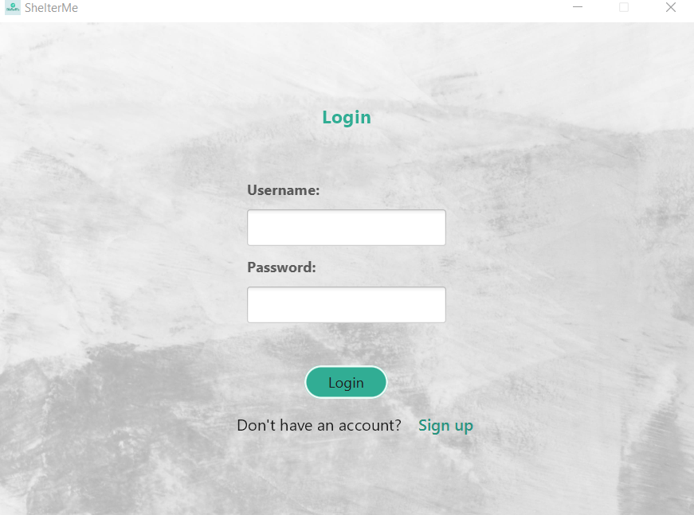
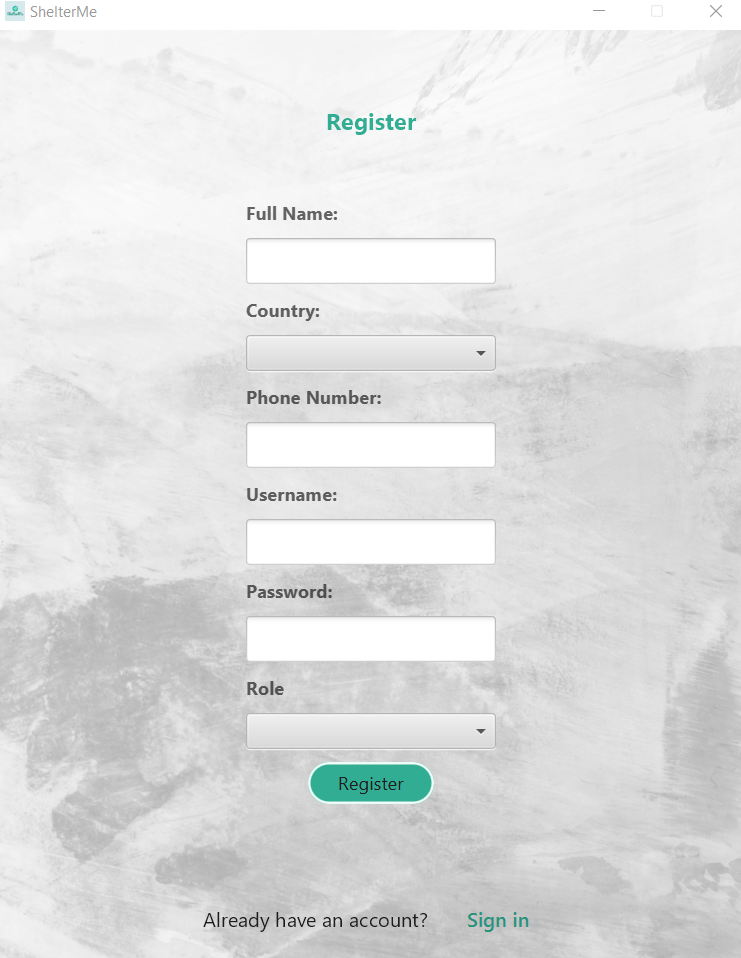
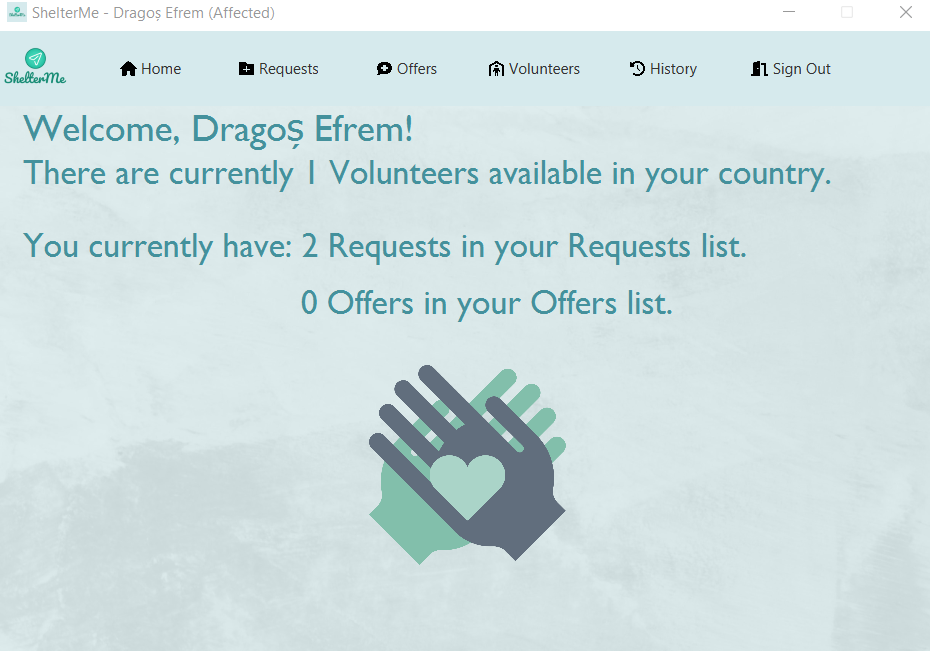

*Note: This application is a college project that presents our skills and work. It may or may not be supported in the future with updates.*

<p align="center">
  
</p>

ShelterMe is a desktop app developed in Java. It's main scope is to unite people affected from all places of the world with the people that are there to help them. Project made for the Foundations of Software Engineering lab by @SebiGabor and @dragosefrem, during our second year of Computer Engineering studies at Polytechnic University of Timișoara. Technologies used:
* [Java 17](https://www.oracle.com/java/technologies/javase-downloads.html)
* [JavaFX 18](https://openjfx.io/openjfx-docs/) (as GUI)
* [Maven](https://maven.apache.org/) (build tool)
* [Nitrite Java](https://www.dizitart.org/nitrite-database.html) (as Database)

## Prerequisites
To be able to install and run this project, please make sure you have installed Java 17 or higher. Otherwise, the setup will note work!
To check your java version, please run `java -version` in the command line.

To install a newer version of Java, you can go to [Oracle](https://www.oracle.com/java/technologies/javase-downloads.html) or [OpenJDK](https://jdk.java.net/).

It would be good if you also installed Maven to your system. To check if you have Maven installed run `mvn -version`.

If you need to install any of them, please refer to this [Maven tutorial](https://www.baeldung.com/install-maven-on-windows-linux-mac).

Make sure you install JavaFX SDK on your machine, using the instructions provided in the [Official Documentation](https://openjfx.io/openjfx-docs/#install-javafx). Make sure to export the `PATH_TO_FX` environment variable, or to replace it in every command you will find in this documentation from now on, with the `path/to/javafx-sdk-18/lib`.

## Setup & Run
To set up and run the project locally on your machine, please follow the next steps.

### Clone the repository
Clone the repository using:
```git
git clone https://github.com/ShelterMe-app/ShelterMe
```

### Verify that the project Builds locally
Open a command line session and `cd ShelterMe`.
If you have installed all the prerequisites, you should be able to run any of the following commands:
```
mvn clean install
```
If you prefer to run using the wrappers, you could also build the project using 
```
./mvnw clean install (for Linux or MacOS)
or 
mvnw.cmd clean install (for Windows)
```

### Open in IntelliJ IDEA
To open the project in IntelliJ idea, you have to import it as a Maven project.
After you import it, in order to be able to run it, you need to set up your IDE according to the [official documentation](https://openjfx.io/openjfx-docs/). Please read the section for `Non-Modular Projects from IDE`.
If you managed to follow all the steps from the tutorial, you should also be able to start the application by pressing the run key to the left of the GUIStarter (or Main) class.

### Run the project with Maven
The project has already been setup for Maven according to the above link.
To start and run the project use one of the following commands:
* `mvn javafx:run` or `./mvnw javafx:run` (run the `run` goal of the `javafx` maven plugin)

To understand better how to set up a project using JavaFX and [Maven](https://openjfx.io/openjfx-docs/#maven), please check the [official OpenJFX documentation](https://openjfx.io/).

You should see an application starting, that looks like this:

<p align="center">
  
</p>

Pressing on the `Sign up` button will redirect to the following window:

<p align="center">
  
</p>

And the main page after logging in looks like this:

<p align="center">
  
</p>

### Technical Details

#### Encrypting Passwords
Encrypting the passwords is done via the following 2 Java functions, found in [UserService.java](https://github.com/fis2021/SimpleRegistrationExample/blob/main/src/main/java/org/loose/fis/sle/services/UserService.java):
```java
    private static String encodePassword(String salt, String password) {
        MessageDigest md = getMessageDigest();
        md.update(salt.getBytes(StandardCharsets.UTF_8));

        byte[] hashedPassword = md.digest(password.getBytes(StandardCharsets.UTF_8));

        // This is the way a password should be encoded when checking the credentials
        return new String(hashedPassword, StandardCharsets.UTF_8)
                .replace("\"", ""); //to be able to save in JSON format
    }

    private static MessageDigest getMessageDigest() {
        MessageDigest md;
        try {
            md = MessageDigest.getInstance("SHA-512");
        } catch (NoSuchAlgorithmException e) {
            throw new IllegalStateException("SHA-512 does not exist!");
        }
        return md;
    }
```

#### Nitrite Java
Nitrite Java was used in the [UserService.java](https://github.com/ShelterMe-app/ShelterMe/blob/main/src/main/java/org/ShelterMe/project/services/UserService.java) file, where we initialized a database, and a _Repository_ of User objects:
```java
    private static ObjectRepository<User> userRepository;

    public static void initDatabase() {
        Nitrite database = Nitrite.builder()
                .filePath(getPathToFile("registration-example.db").toFile())
                .openOrCreate("test", "test");

        userRepository = database.getRepository(User.class);
    }
```

This Repository was further used to add new users, by using the **insert** method:
```java
    public static void addUser(String username, String password, String role) throws UsernameAlreadyExistsException {
        checkUserDoesNotAlreadyExist(username);
        userRepository.insert(new User(username, encodePassword(username, password), role));
    }
```
and to find all users, by using the find method:
```java
    private static void checkUserDoesNotAlreadyExist(String username) throws UsernameAlreadyExistsException {
        for (User user : userRepository.find()) {
            if (Objects.equals(username, user.getUsername()))
                throw new UsernameAlreadyExistsException(username);
        }
    }
```

## Resources
To understand and learn more about **JavaFX**, you can take a look at some of the following links:
* [Introduction to FXML](https://openjfx.io/javadoc/16/javafx.fxml/javafx/fxml/doc-files/introduction_to_fxml.html)
* [Getting Started with JavaFX](https://openjfx.io/openjfx-docs/)
* [JavaFX Tutorial](https://code.makery.ch/library/javafx-tutorial/)
* [JavaFX Java GUI Design Tutorials](https://www.youtube.com/playlist?list=PL6gx4Cwl9DGBzfXLWLSYVy8EbTdpGbUIG)

To better understand how to use **Nitrite Java**, use the following links:
* [Nitrite Java Github Repository](https://github.com/nitrite/nitrite-java) 
* [Nitrite Java Project Page](https://www.dizitart.org/nitrite-database.html)
* [Nitrite Java Documentation Page](https://www.dizitart.org/nitrite-database/)
* [Nitrite Java: Filters](https://www.dizitart.org/nitrite-database/#filter)
* [Nitrite: How to Create an Embedded Database for Java and Android](https://dzone.com/articles/nitrite-how-to-create-an-embedded-database-for-jav)
* [Nitrite: An Embedded NoSQL Database for Java and Android](https://medium.com/@anidotnet/nitrite-an-embedded-nosql-database-for-java-and-android-318bf48c7758)

